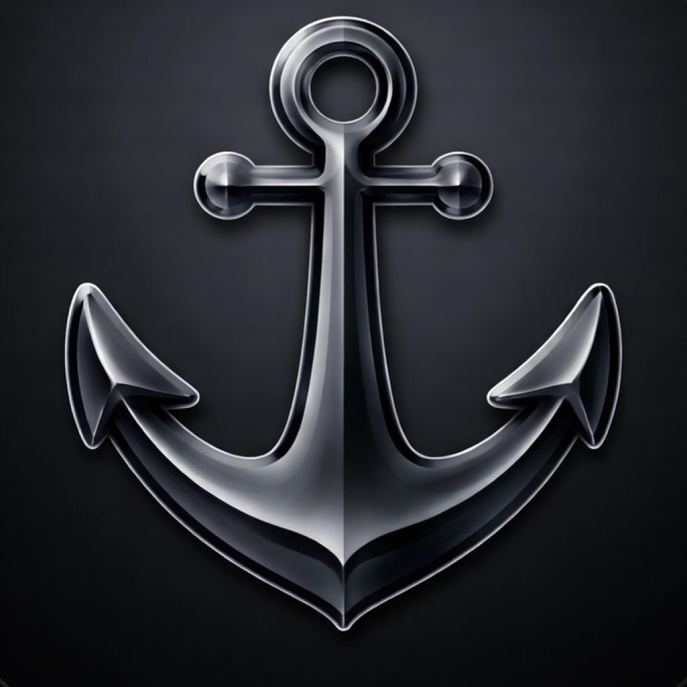

  

<h1 align="center">HarbourMaster</h1>

Know what's running on your ports.

  
  
  

 

  
  
  

---

HarbourMaster lives in your menu bar and shows every TCP port currently in use — instantly, without opening a terminal. It detects dev servers, Docker containers, and macOS system services, and tells you exactly what's running and where.

## Features

**Port monitoring**
- Background scan every 5 seconds — notified the moment a port opens or closes via a HUD toast (no permissions required)
- Automatically recognises dev runtimes (node, python, bun, go, ruby, deno, rust, java…) regardless of port number
- Configurable dev port list with individual ports and ranges (e.g. `3000–3400`), with overlap warnings

**Per-port actions**
- Open in browser · Copy URL · Open in Finder · Open in Terminal · Copy path · Kill process

**Docker**
- Ports resolved to real container names and images via `docker ps`
- Grouped by Compose project — one line per stack, hover to expand services
- Per-container: Restart · Pause/Unpause · Stop · View Logs · View Project Logs · Open Shell
- Opens containers in Docker Desktop or OrbStack (auto-detected)
- Real CPU/memory stats from `docker stats`, not host proxy RSS

**Color legend**

| | Meaning |
|--|---------|
| 🟢 circle | Dev port — known runtime or configured port |
| 🔵 circle | Other user process |
| 🟢 box | Docker container — running |
| ⚪ box | Docker container — paused |
| 🟠 shield | macOS system service (AirPlay, Handoff…) |

## Settings

Four-tab window (`⌘,`) — launch at login, preferred browser, preferred terminal, Docker container manager (Docker Desktop / OrbStack), configurable dev ports and ranges.

  
  

## Requirements

- macOS 13 Ventura or later
- Docker CLI (optional — required for Docker features)
